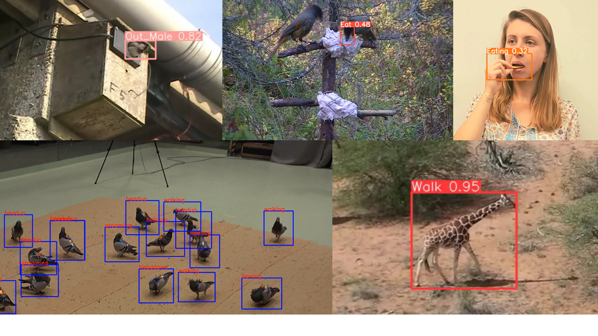

# YOLO-Behaviour: A simple, flexible framework to automatically quantify animal behaviours from videos
Alex Hoi Hang Chan, Prasetia Putra, Harald Schupp, Johanna Köchling, Jana Straßheim, Britta Renner, Julia Schroeder, William D. Pearse, Shinichi Nakagawa, Terry Burke, Michael Griesser, Andrea Meltzer, Saverio Lubrano, Fumihiro Kano


## Description
This repository contains code for the YOLO-Behaviour framework, a simple method for behavioural quantification in videos.

Please refer to the ["Documentation"](https://alexhang212.github.io/YOLO_Behaviour_Repo/) for full installation and implementation guidelines, and the [preprint]() for detailed description of the method!




## Abstract

> Manually coding behaviours from videos is essential to study animal behaviour but it is labour-intensive and susceptible to inter-rater bias and reliability issues. Recent developments of computer vision tools enable the automatic quantification of behaviours, supplementing or even replacing manual annotations. However, widespread adoption of these methods is still limited, due to the lack of annotated training datasets and domain-specific knowledge required to optimize these models for animal research. Here, we present YOLO-Behaviour, a flexible framework for identifying visually distinct behaviours from video recordings. The framework is robust, easy to implement, and requires minimal manual annotations as training data. We demonstrate the flexibility of the framework with case studies for event-wise detection in house sparrow nestling provisioning, Siberian jay feeding, human eating behaviours, and frame-wise detections of various behaviours in pigeons, zebras, and giraffes. Our results show that the framework reliably detects behaviours accurately, and retrieve comparable accuracy metrics to manual annotation. However, metrics extracted for event-wise detection were less correlated with manual annotation, and potential reasons for the discrepancy between manual annotation and automatic detection are discussed. To mitigate this problem, the framework can be used as a hybrid approach of first detecting events using the pipeline and then manually confirming the detections, saving annotation time. We provide detailed documentation and guidelines on how to implement the YOLO-Behaviour framework, for researchers to readily train and deploy new models on their own study systems. We anticipate the framework can be another step towards lowering the barrier of entry for applying computer vision methods in animal behaviour.


## Quick Start
We provide a whole pipeline from data annotation to model training to inference in the [Documentation](https://alexhang212.github.io/YOLO_Behaviour_Repo/). Here, we will run a quick demo inference visualization. Make sure you download the [sample dataset](), and place it under the `Data/` directory.

### Installation
There are a series of required packages to run the pipeline. We recommend creating a [conda environment](https://www.anaconda.com/). 

You can create a new environment and install required packages by running:
```
conda create -n YOLO python=3.8
conda activate YOLO

pip install -r requirements.txt
```

### Run Inference on sample data
After installation and downloading the sample dataset, run this in the terminal, making sure that the current working directory is in `YOLO_Behaviour_Repo`. You can change your working directory by doing `cd /path/to/YOLO_Behaviour_Repo`

```
python Code/3_VisualizeResults.py --Video "./Data/JaySampleData/Jay_Sample.mp4" --Weight  "./Data/Weights/JayBest.pt" --Start 0 --Frames -1

```

## Citation


## Contact
If you have any questions/ suggestions with the pipeline, or any additional instructions/ guidelines you would like to see in the documentation, feel free to leave a git issue or shoot me an email!

hoi-hang.chan[at]uni-konstanz.de